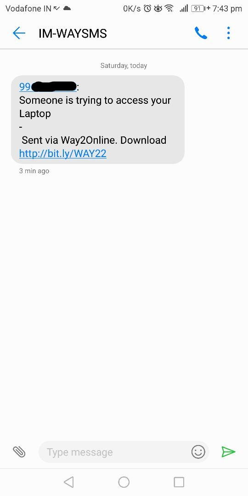

# simple-login-alert

<b>A Simple Login System with alert message to your phone when invalid access.</b>
  

Using way2sms, whenever there's a invalid login will send a alert message to your number.
  
Langauges used : <b>Python, sqllite</b>
  
<i>login_gui.py</i> file opens the main gui with login table. 
<i>way2sms.py</i> is a default module imported from <a href='https://github.com/shubhamc183/way2sms'>here (Github).</a>  

You need to have a way2sms account and specify your login number and password of way2sms in the <i>login_gui.py</i> file.

 
<b>Screenshots</b> 
 
 

